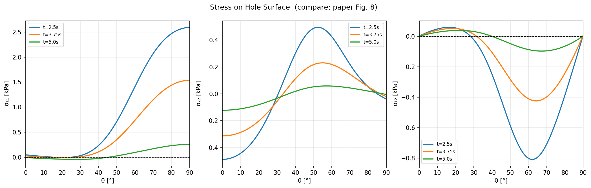
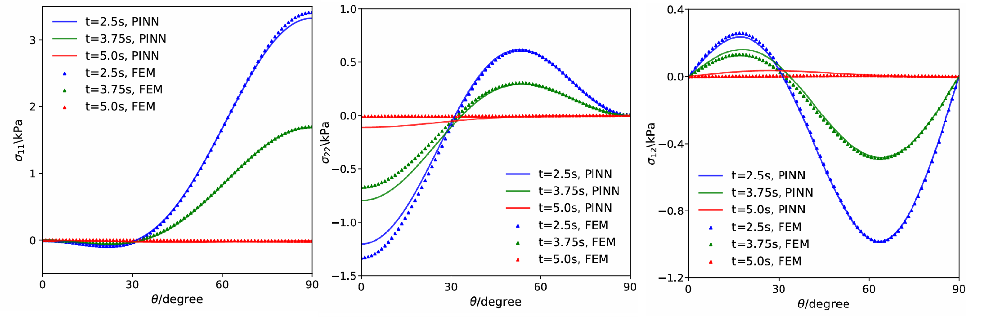
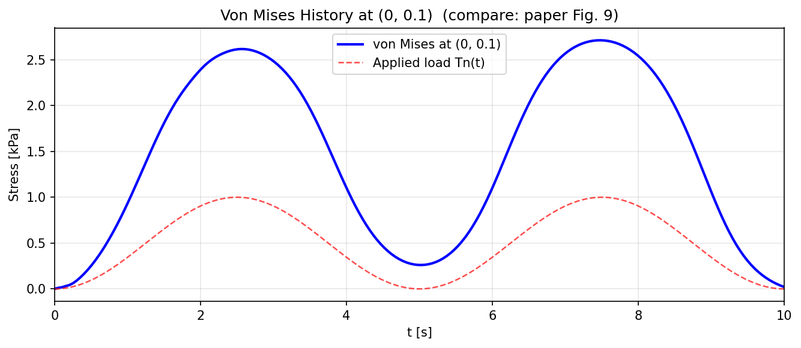
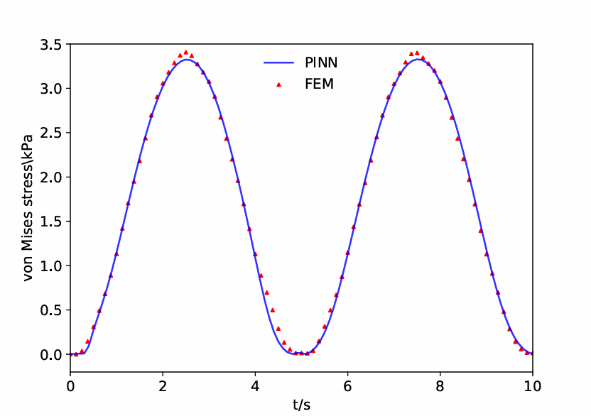
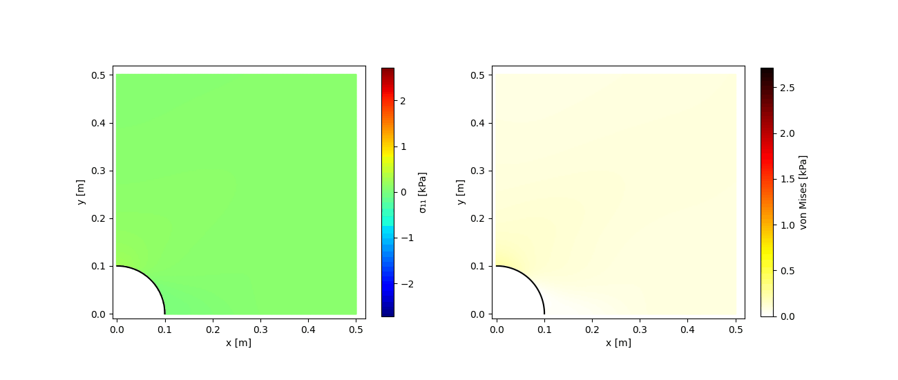

# PINN-Elastodynamics-PyTorch

A PyTorch reimplementation of the composite Physics-Informed Neural Network (PINN)
from Rao, Sun & Liu (2021), *"Physics-informed deep learning for computational
elastodynamics without labeled data"* ([arXiv:2006.08472](https://arxiv.org/abs/2006.08472)).
This covers the paper's plate-with-a-hole benchmark: a square plate with a circular
hole in it, stretched by a cyclic load, solved with a PINN instead of FEM.

The original authors' TensorFlow 1.x code is included here as `reference/train.py`
for comparison. This repository contains an independent PyTorch reimplementation. It's not a full
reproduction of the paper and isn't meant to be one, but the implementation reproduces the main qualitative behaviour of the benchmark and achieves reasonable agreement with the paper's FEM and PINN results.

## The problem

A quarter of a square plate (0.5 m x 0.5 m), with a circular hole of radius 0.1 m at
the corner, is pulled by a cyclic traction on one edge:

```
Tn(t) = 0.5 * sin(2*pi*t/T0 + 1.5*pi) + 0.5,   T0 = 5 s,  t in [0, 10] s
```

Plane stress, linear elastic material (E = 20 , nu = 0.25, rho = 1.0). Instead of meshing
the plate and solving with finite elements, a neural network is trained to directly
output the displacement and stress fields (u, v, sigma11, sigma22, sigma12) at any
point (x, y, t), by minimizing the residual of the governing PDEs, Hooke's law, and
the boundary conditions. No FEM or measurement data is used to train it. Only the
physics.

Boundary and initial conditions are enforced by construction rather than as a soft
loss penalty:

```
U(x, y, t) = U_particular(x, y, t) + D(x, y, t) * U_general(x, y, t)
```

`U_particular` and the distance function `D` are small networks pretrained separately
and then frozen. Since `D` is zero everywhere on the boundaries and at t=0, the
composite output automatically equals `U_particular` there, so the boundary/initial
conditions come out exactly right no matter what the trainable `U_general` network
does. Only `U_general` is trained against the PDE.

## Repository structure

```
.
├── README.md
├── LICENSE
├── notebook/
│   ├── plate_with_hole.ipynb    # full notebook, point generation through training and plots
│   ├── dist_net_final.pth
│   ├── part_net_final.pth
│   └── uv_net_final.pth
├── reference/
│   └── train.py                 # original authors' TF1 script
└── results/
    ├── ...                      # plots and animation
    └── paper_reference/         # the paper's own figures, for comparison
```

## Running it

Built and trained entirely on Google Colab. Open `notebook/plate_with_hole.ipynb` and run it
top to bottom. The notebook mounts Google Drive for saving/loading checkpoints,
since a full training run doesn't comfortably fit in one (free) Colab session; it's built
around stopping and resuming rather than a single continuous run.

If you just want to use the already-trained networks without retraining, the three
`.pth` files in `notebook/` are the final weights for the distance network,
particular-solution network, and general-solution network.

## Results

**Stress on the hole surface** at t = 2.5, 3.75, 5.0 s, compared against the paper's
FEM and PINN results:



*Paper's reference (FEM + their PINN) for the same plot:*



The predicted stress distributions replicate the main shapes, signs, and temporal ordering of the reference results, indicating that the model captures the qualitative elastodynamic behaviour of the problem.

**Von Mises stress history** at the point (0, 0.1):



*Paper's reference for the same plot:*



The period of oscillation matches the applied load correctly, but the peak
magnitude undershoots the paper's reference by roughly 18%.


**Stress evolution over the full simulation**, compared to the paper's own
animation:


*Paper's animation:*


### An earlier, less accurate run

Two extra plots, `results/stage1_hole_surface_stresses.png` and
`results/stage1_von_mises_history.png`, are saved in the repo as a before/after
comparison. They come from an earlier checkpoint that used a different loss
weighting (explained below) and clearly undershoot compared to the final results
above, even though the traction-free hole condition was satisfied very tightly in
that run. I thought it was a cool way to visualize the evolution of the training.

## How this differs from the original implementation

A few things changed between the original TensorFlow code and this PyTorch version,
some on purpose and some as compute tradeoffs. Recording them here so it's clear
what to expect if you compare the two directly.

**Framework port.** The usual TF1-to-PyTorch translation: placeholders became
tensors with `requires_grad=True`, `tf.gradients` became `torch.autograd.grad`, and
the original's L-BFGS-B (via SciPy) became `torch.optim.LBFGS` with a strong-Wolfe
line search. Xavier initialization, tanh activations, and float64 precision are all
kept the same as the original.

**Loss weighting, in two stages instead of one fixed value.** The original code
weights the PDE residual and the hole traction-free condition equally:

```python
self.loss = 10 * (self.loss_f_uv + self.loss_f_s + self.loss_HOLE)
```

An early attempt at matching this exactly from scratch (equal weights on both terms
from the start) caused the network to collapse toward a trivial, near-zero solution.
The hole condition just wasn't being enforced strongly enough early in training to
pull it out of that. So training here happened in two stages instead:

1. First, with the hole-traction term weighted much more heavily (`w_hole = 500` vs.
   `w_pde = 10`), to force the traction-free condition to be learned before anything
   else.
2. Once that pushed the model off the trivial solution, training resumed with equal
   weights (`w_pde = w_hole = 10`), matching the original paper exactly, to refine
   the rest of the field.

The final saved weights and every plot in `results/` (aside from the two `stage1_`
plots) come from the second stage. It's an open question whether the original paper
avoided this collapse simply by using a much larger set of collocation points
(see below), rather than needing a staged weighting at all.

**Fewer collocation points.** Roughly half the original's interior point density:

| Point set | Original | This repo |
|---|---|---|
| Global collocation points | 70,000 | 35,000 |
| Refinement points near the hole | 40,000 | 20,000 |
| Hole surface points | 9,960 | 9,960 |
| Initial condition points | 5,000 | 5,000 |
| Each symmetry/free/loaded edge | 8,000 | 8,000 |
| Loaded edge (right side) | 13,000 | 13,000 |

Only the interior and near-hole refinement counts were reduced, to fit within
Colab's free-tier memory and runtime limits. Boundary and initial condition points
match the original exactly. This is probably the biggest reason the results here
don't match the paper as closely near the hole, where the stress gradients are
steepest. If reproducing this with more compute available, restoring the full point
counts is the first thing worth trying.

**Network architecture** is unchanged from the original: distance and particular
networks are 4 hidden layers of 20 neurons each, and the general-solution network is
8 hidden layers of 70 neurons each, all with tanh activations.

**Input normalization**, added on top of the original. The original network takes
raw (x, y, t) coordinates. Here, inputs are normalized before the general-solution
network:

```python
x_norm = (x - 0.25) / 0.25
y_norm = (y - 0.25) / 0.25
t_norm = (t - 5.0) / 5.0
```

This was added because t ranging over [0, 10] next to x, y ranging over [0, 0.5]
seemed likely to bias early training toward the time dimension. It's a deliberate
change, not something carried over from the original.

**A short Adam warmup before L-BFGS.** The original trains the physics network with
L-BFGS-B alone. Here, 1,000 epochs of Adam (lr = 1e-3) run first, before switching to
L-BFGS, following the common practice of using Adam to find a reasonable region and
L-BFGS to refine it. The distance and particular-solution network pretraining stages
do match the original's approach of pure L-BFGS.

## Known limitations

- Training was stopped due to Colab's compute and runtime limits, not because the
  loss had converged. The L-BFGS loss was still decreasing.
- Half the collocation density of the original, which likely explains most of the
  remaining gap near the hole.
- No convergence or network-size study like the one in the paper's own Table 1, so
  there's no direct evidence the current network is large enough at this point
  density, just that the results look reasonable at the one setup tried.
- This is a student project result, not a peer-reviewed reproduction. Treat the
  numbers above as indicative, not final.

## Citation

If you use this code, please cite the original paper:

> Rao, C., Sun, H., & Liu, Y. (2021). Physics-informed deep learning for
> computational elastodynamics without labeled data. *Journal of Engineering
> Mechanics*. [arXiv:2006.08472](https://arxiv.org/abs/2006.08472)

This repository is an independent reimplementation and isn't affiliated with the
original authors.

## License

MIT, see [LICENSE](LICENSE). `reference/train.py` is the original authors' code;
check [Raocp/PINN-elastodynamics](https://github.com/Raocp/PINN-elastodynamics) for
its license before redistributing that file on its own.
